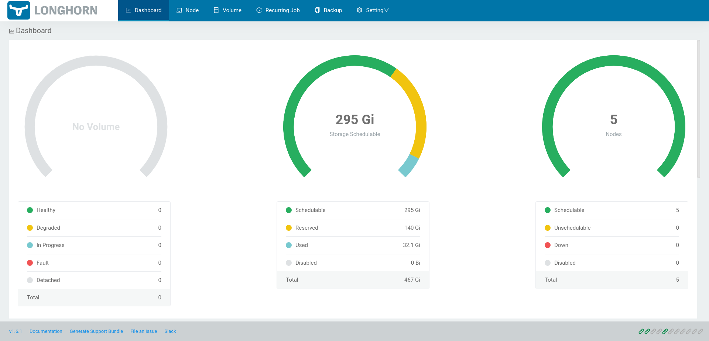

# Deploy Longhorn

This guide walks you through deploying Longhorn on a Kubernetes cluster. Longhorn is a distributed
block storage system for Kubernetes that is built using containers. It provides features such as
snapshots, backups, and volume expansion.

## What you'll need

To complete this guide, you'll need the following:

* A running [Kubernetes](kubernetes) cluster.

## Procedure

Follow the steps below to deploy Longhorn on a Kubernetes cluster:.

### Step 1: Install Requirements

Follow the steps below to install the required libraries on each Kubernetes node:

1. SSH into each Kubernetes node:

    ```console
    user:~/virtlml$ ssh root@<node-ip>
    ```

    ```{note}
    Replace `<node-ip>` with the IP address of the node.
    ```

1. Install the required libraries:

    ```console
    root@node1:~# apt update & apt install -y sudo jq
    ```

```{important}
Repeat this process for each Kubernetes node.
```

### Step 2: Deploy Longhorn

Follow the steps below to deploy Longhorn on the Kubernetes cluster:

1. Return to your local environment:

    ```console
    root@node1:~# exit
    ```

1. Apply the Longhorn manifests:

    ```console
    user:~/virtlml$ kubectl apply -k manifests/longhorn/overlays/kubeflow
    ```

    ```{note}
    This command will deploy Longhorn on the Kubernetes cluster. It may take a few minutes for the
    deployment to complete.
    ```

## Verify

To verify that Longhorn is running, run the following commands:

1. Check that the Longhorn pods are running:

    ```console
    user:~/virtlml$ kubectl get pods -n longhorn-system
    csi-attacher-5c4bfdcf59-76dpt                       1/1     Running   0          6m34s
    csi-attacher-5c4bfdcf59-zc96c                       1/1     Running   0          6m34s
    csi-attacher-5c4bfdcf59-zpcrd                       1/1     Running   0          6m34s
    csi-provisioner-667796df57-l4bvn                    1/1     Running   0          6m34s
    csi-provisioner-667796df57-tn5mt                    1/1     Running   0          6m34s
    csi-provisioner-667796df57-wr9gz                    1/1     Running   0          6m34s
    csi-resizer-694f8f5f64-krdwn                        1/1     Running   0          6m34s
    csi-resizer-694f8f5f64-q7r64                        1/1     Running   0          6m34s
    csi-resizer-694f8f5f64-st9vb                        1/1     Running   0          6m34s
    csi-snapshotter-959b69d4b-2trb4                     1/1     Running   0          6m34s
    csi-snapshotter-959b69d4b-44bdw                     1/1     Running   0          6m34s
    csi-snapshotter-959b69d4b-nmxxz                     1/1     Running   0          6m34s
    engine-image-ei-5cefaf2b-2cpx5                      1/1     Running   0          6m40s
    engine-image-ei-5cefaf2b-5kkpx                      1/1     Running   0          6m40s
    engine-image-ei-5cefaf2b-6lw22                      1/1     Running   0          6m40s
    engine-image-ei-5cefaf2b-7tj7g                      1/1     Running   0          6m40s
    engine-image-ei-5cefaf2b-bmbxl                      1/1     Running   0          6m40s
    instance-manager-143975653f867415efd89c7528bfdfd9   1/1     Running   0          6m39s
    instance-manager-931660a4d81395a5ee4a44842096109a   1/1     Running   0          6m40s
    instance-manager-d7ddfb2f3c3853b122fcc734777e3447   1/1     Running   0          6m39s
    instance-manager-e3d1d6988014e64b4f12d6d513f72715   1/1     Running   0          6m40s
    instance-manager-e58918fd8369607e8bff43f3856618be   1/1     Running   0          6m39s
    longhorn-csi-plugin-8twkq                           3/3     Running   0          6m34s
    longhorn-csi-plugin-cq6pw                           3/3     Running   0          6m34s
    longhorn-csi-plugin-fvf6p                           3/3     Running   0          6m34s
    longhorn-csi-plugin-rwgg9                           3/3     Running   0          6m34s
    longhorn-csi-plugin-xzrlt                           3/3     Running   0          6m34s
    longhorn-driver-deployer-7449f56699-h52tj           1/1     Running   0          6m47s
    longhorn-iscsi-installation-2jgww                   1/1     Running   0          6m47s
    longhorn-iscsi-installation-6p9f8                   1/1     Running   0          6m47s
    longhorn-iscsi-installation-r8bbc                   1/1     Running   0          6m47s
    longhorn-iscsi-installation-v9pz2                   1/1     Running   0          6m47s
    longhorn-iscsi-installation-vwphj                   1/1     Running   0          6m47s
    longhorn-manager-4k2hl                              1/1     Running   0          6m47s
    longhorn-manager-4zvhw                              1/1     Running   0          6m47s
    longhorn-manager-7p99c                              1/1     Running   0          6m47s
    longhorn-manager-96rnf                              1/1     Running   0          6m47s
    longhorn-manager-rxfr6                              1/1     Running   0          6m47s
    longhorn-nfs-installation-4h9qq                     1/1     Running   0          6m47s
    longhorn-nfs-installation-7d847                     1/1     Running   0          6m47s
    longhorn-nfs-installation-9krbq                     1/1     Running   0          6m47s
    longhorn-nfs-installation-bt4x2                     1/1     Running   0          6m47s
    longhorn-nfs-installation-pggtb                     1/1     Running   0          6m47s
    longhorn-ui-6c8c4fcbb8-2p7ld                        1/1     Running   0          6m47s
    longhorn-ui-6c8c4fcbb8-fhrbh                        1/1     Running   0          6m47s
    ```

    ```{note}
    This command will list all the Longhorn pods in the `longhorn-system` namespace. After a couple of
    minutes, all the pods should be in the `Running` state.
    ```

1. Launch the Longhorn UI:

    ```console
    user:~/virtlml$ kubectl port-forward -n longhorn-system svc/longhorn-frontend 8080:80
    ```

    Open a web browser and navigate to [http://localhost:8080](http://localhost:8080). You should
    see the Longhorn UI:

    
